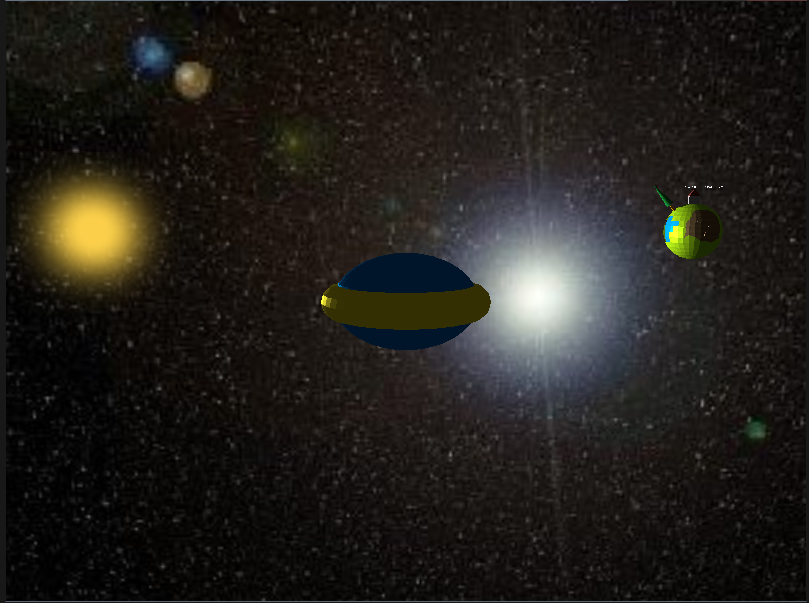
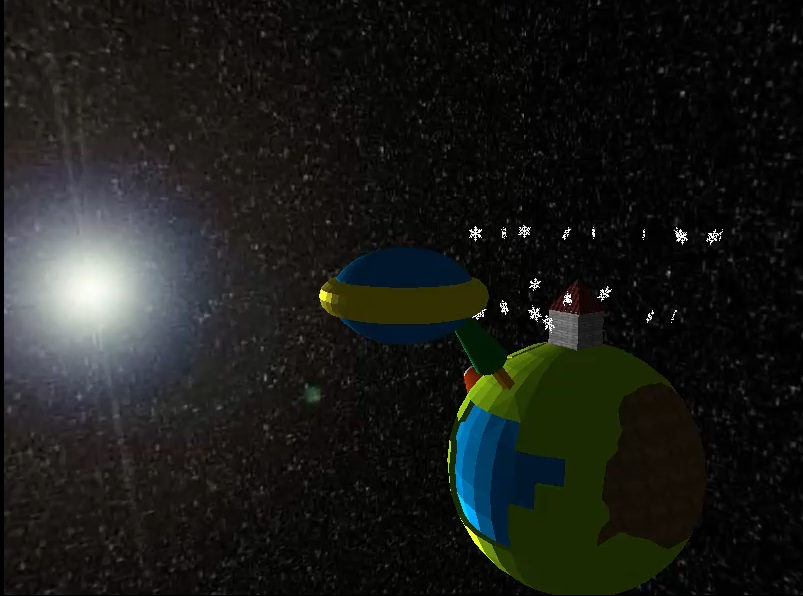
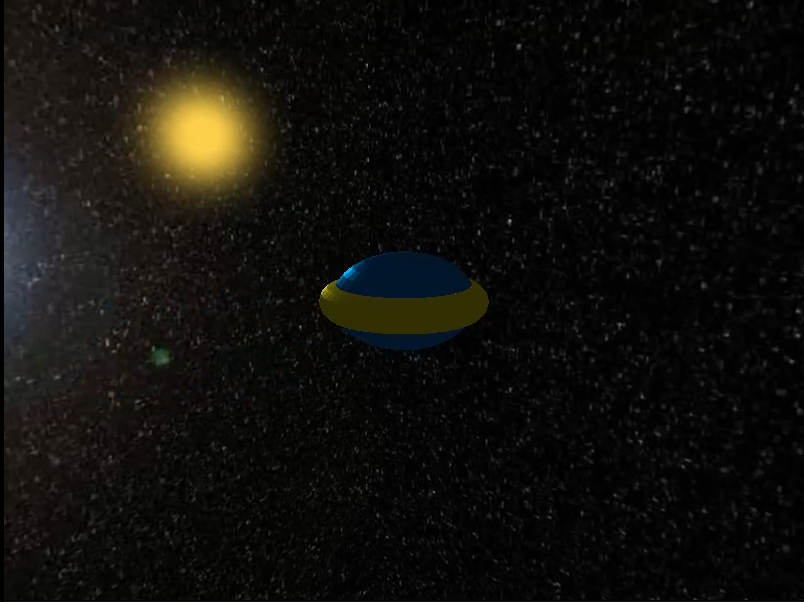
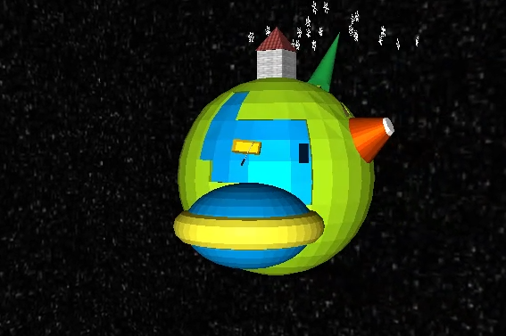
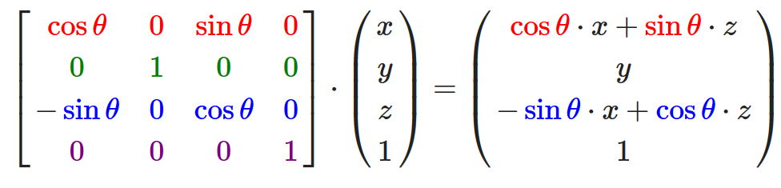

# CG Final Project Report

## 项目介绍以及实现结果
项目的主要实现创意是，场景定为宇宙中的某个小型恒星系，拥有一颗发光的恒星以及一颗有简单地貌和地表建筑的行星。我们的主视角为一艘到访这个星系的宇宙飞船，飞船可以在星系中自由航行，通过键盘上的WASD控制移动，鼠标调整第三人称视角的朝向。
为了在远离星球时快速靠近，和在接近星球后恢复正常速度，我们添加了按住左Shift键来使飞船加速航行的功能，松开按键即可恢复速度。
行星的模型通过在Blender软件中建模和贴图来完成。
同时我们在行星的上方添加了粒子特效来展示简单的地表天气效果。
通过天空盒来实现模拟宇宙中的环境，使场景更加真实。

## 实现效果

  

## 开发环境以及使用到的第三方库
### 开发环境是:
+ Windows10
+ Visual Studio 2017
+ Blender 2.8
### 使用到的第三方库包括:
+ Assimp
+ stb_image
+ SOIL

## 实现功能列表
### Basic
+ Camera Roaming
+ Simple lighting and shading(phong)
+ Texture mapping
+ Shadow mapping
+ Model import & Mesh viewing (Assimp)

### Bonus
1.Sky Box
2.Particle System

## 实现的功能点简单介绍
### Basic
#### 1.Camera Roaming
飞船的第三人称控制，是在原本的摄像机控制的基础之上，将飞船固定在摄像机视角的中央。同时需要改写摄像机控制中的摄像机视角旋转方法，因为第三人称视角下，旋转视角时动的应该是摄像机而不是物体。因此我们在视角旋转后，先计算出摄像机新的Front向量，然后再用当前的飞船位置反向计算出新的摄像机位置，这样实现视角旋转后来使摄像机绕物体旋转，而物体保持不动
#### 2.Simple lighting and shading(phong)
通过运用简单的phong光照模型和phong shading来实现恒星作为光源的光照效果

  

#### 3.Texture mapping
行星上的不同地貌主要通过纹理贴图来完成，同时场景中的恒星，我们没有使用模型，而是对场景中央的一块平面进行纹理贴图，然后在渲染循环中更新平面的旋转矩阵，来使平面始终朝向摄像机的位置。这样通过改变纹理贴图边缘的Alpha通道的值，来使边缘实现透明效果，然后在渲染平面时，启用OpenGL的颜色融合(Blend），来实现太阳周围的模糊光晕效果

  

#### 4.Shadow mapping
使用基本的深度贴图来实现阴影映射，实现效果可以看出飞船在行星表面的投影，以及飞船处于行星背面时被遮挡了恒星光线后飞船整个处于阴影之中
可以看到飞船在行星上的投影

  

#### 5.Model import & Mesh viewing (Assimp)
主要是行星和飞船的模型我们在Blender软件中来建模完成，然后利用第三方库Assimp和自定义的Mesh和Model类来实现模型的导入
### Bonus
#### 1.Sky Box
天空盒使用了立方体贴图(Cube Map)的纹理映射方式，通过渲染一个六面都贴上2D纹理的方盒，将其作为背景来营造场景位于特定背景下的效果。为了让天空盒始终位于其他物体的后面，可以采用最先渲染天空盒并禁用深度测试(后渲染的物体会覆盖先渲染的物体)，或者在天空盒的顶点着色器中，将其的坐标输出的z分量等于其w分量(这样执行透视除法之后，其深度值始终等于1.0)，并且将深度函数从GL_LESS改为GL_LEQUAL，这样有其他物体在前面时天空盒永远通不过深度测试。
#### 2.Particle System
我们通过下面的两个类来实现粒子系统：
+ Particle
+ ParticleSystem
#### Particle
包含了粒子的基本参数以及更新粒子状态，决定粒子渲染方式的函数
关键成员变量:
+ isActive - public bool : 粒子是否仍然存活
+ lifetime - public float : 粒子的生命周期
+ startTime - public clock_t : 粒子开始活动的时间变量（转为浮点数使用）
+ position - public glm::vec3 : 粒子在世界坐标系中的位置
+ velocity - public glm::vec3 : 粒子的速度向量（决定粒子运动的方向和大小）
关键函数：
+ void update() : 更新粒子的状态 —— 根据速度向量更新粒子的坐标，以及通过`clock_t clock()`函数获取当前的时间，与`startTime`相减后和`lifetime`进行比较，判断粒子是否仍处于活跃状态
+ void render() : 粒子的渲染函数
#### ParticleSystem
这个类决定了整个粒子系统的具体特性和功能，运用**工厂模式**，回收利用已经达到生命终点的粒子
关键成员变量:
+ position - glm::vec3 : 粒子系统整体的位置，根据这个位置对粒子的发射位置进行初始化
+ direction - glm::vec3 : 粒子系统的整体发射方向，根据这个向量对粒子的发射速度(方向)进行初始化
+ speed - float : 决定粒子的发射速度大小
+ lifetime - float : 决定粒子的生命周期
+ size - int : 决定粒子初始化位置的范围
+ emissionRate - float : 粒子的发射速率
+ last - clock_t : 上次粒子的发射时间
+ particles - Particle[] : 当前生成的粒子
+ numberOfParticles - int : 当前的粒子数目
此外还有一个宏定义的量`MAX_PARTICLE_NUM`，这个值决定了最大的粒子个数，这里设置为20
关键成员函数：
+ void update() : 这个函数首先获取当前时间(currentTime)，并与上次粒子的发射时间(last)计算，判断是否大于 1/emmisionRate 并且当前粒子数目小于最大粒子数目，则调用 `spawn()` 函数生成一个粒子，并设置为活跃状态；此外，通过一个循环根据当前粒子数目遍历所有粒子，并调用它们的 `update()` 函数，然后判断他们的`isActive`是否为 `false`，则调用它们的 `respawn(int index)` 函数。当然，这些都是在`isPause`为`false`情况下才会进行的操作，否则这个函数将不会对粒子的状态进行任何的更新
+ void spawn() : 根据粒子系统的`position`,`direction`和`size`对粒子的位置和速度进行初始化，并设置粒子的`lifetime`以及粒子大小等相关成员变量
+ void respawn(int index) : 重新发射粒子，即，对粒子的位置和速度重新初始化，并将其`isActive`重新设置为`true`
+ void pause() : 设置`isPause`为`true`
+ void start() : 设置`isPause`为`false`
## 遇到的问题和解决方案
### 1.关于天空盒和带 alpha 通道贴图问题
我们的恒星是使用有透明度的平面纹理贴图来实现的，然而在一开始渲染时它虽然可以透视后面的行星和飞船，但仍然会挡住后面的天空盒。这是由于使用天空盒实现的第二种优化方案时，天空盒的深度始终为最大值且深度函数设为小于等于。因此只能使用最基础的最先渲染天空盒的方式，这样透明贴图才不会遮挡住天空盒。
### 2.关于太阳贴图的问题
我们希望用一张贴图来表示我们的太阳，需要解决的问题就是：如何让这张贴图始终朝向摄像机的方向。一开始通过计算太阳的位置和摄像机的位置得到太阳朝向向量，并结合asin()反正弦函数得到这个向量的两个欧拉角的弧度值，再利用glm::rotate()函数来得到最终的model矩阵。但是，受到反正弦函数的返回值的范围限制（在[-pi/2,pi/2]之间），使得当方向向量两个欧拉角的真实弧度值在[pi/2, 3pi/2]时，返回值依然是在原来范围中，使得贴图在一定角度范围中会朝向一个错误的方向，而这仅限于水平方向上的运动（因为事实上，垂直方向的运动所得到的弧度值只会在[-pi/2,pi/2]之间）。所以对于绕y轴旋转的弧度值只能通过构造一个旋转变换矩阵自己实现这个变换而不是调用glm::rotate()函数，即，通过得到绕y轴旋转角的sin和cos值，构造旋转矩阵：

  

在渲染贴图的函数中用这个矩阵乘以model矩阵。最终，实现了贴图朝向摄像机的效果
## 小组成员分工
+ 林一山16340144：粒子系统实现，恒星贴图的实现
+ 刘峻佚16340151：Blender建模，模型导入，基本场景搭建和行星运动动画，摄像机第三人称控制系统
+ 罗源茂16340163：phong lighting, phong shading模型实现
+ 卢林鹏16340159：阴影映射的实现，天空盒
